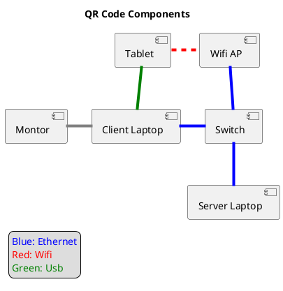

# Howto run a demonstration of the system

## Dummy Drivers

This shows how dummy drivers can talk directly to each other. It will produce errors as there is nowhere for the key to go.
Run `demo/run-devices.sh`

## Chat program

This shows drivers + site agents + encryption tunnels.
Anything typed into one of the blank windows will be encrypted using a key from one site and sent to the other for decryption and displayed in the other blank window. It uses tcp ports and netcat.
Run `demo/run-chat.sh`

## QR Code demo

The pysical setup of this demo consists of: 
- 2x Laptops acting as nodes
  + One Web server
  + One QR client
- WiFi access point
- Network switch
- Optional repeater screans



> The pin for the tablet/phones: `1234`

Install the latest release from [gitlab](https://gitlab.com/QComms/cqptoolkit/-/jobs/artifacts/master/download?job=package:deb). This can be done on the command line with: `curl -JLO "https://gitlab.com/QComms/cqptoolkit/-/jobs/artifacts/master/download?job=package%3Adeb"`

### Sites

Make sure that each device can resolve the address of the other by host name (check with `ping <hostname>` ).

- Run an instance of `SiteAgentRunner` at each location. Its best to use the `-p` option to set the port number.
- Run a pair of `DummyQKDDriver -r localhost:<site agent port>` for each link, add `-b` to run as bob.
- Start the links by ether `SiteAgentCtlGui`:
  + Clicking **Add** in the top left for each site, entering the sites host and port
  + Expand each site, select the device and click **From** for one side, select the entry in the table on the right then select the paired device in the next site and click **to**
  + Click **Start link**
- Or by tailoring the JSON string below for the setup:
```
   SiteAgentCtl -c <start site address> -b '{"hops":[{"first":{"site":"192.168.100.3:9000","deviceId":"dummyqkd_0__32_alice"},"second":{"site":"192.168.100.2:9000","deviceId":"dummyqkd_0__32_bob"}}]}'
```

  + The device ids can be obtained by calling `SiteAgentCtl -c <site address> -d`

### Web server

- Update the webserver code with `docker pull registry.gitlab.com/qcomms/cqptoolkit/nginx-qkd`
- Checkout the website with `git clone https://gitlab.com/QComms/qkd-website.git www`
- Tailor the config from cqptoolkit/demo/nginx-config to your needs.
  + Set the `psk_identity_hint` to the address the client will need to use to request a key.
  + Set the `hsm` field to the host:port of the local site agent
- Create a script to simplify the startup, eg run-website.sh:
```
#/bin/bash
sudo chown -R 33:33 www
docker run -it --rm --net host -v `pwd`/www:/www -v `pwd`/nginx-conf:/etc/nginx registry.gitlab.com/qcomms/cqptoolkit/nginx-qkd
```
- Run the webserver with the script.
- The site can be tested without encryption by going to [http://localhost/](http://localhost/) you should see a page with "Unsecured communication"

### Mobile Setup

- Install the latest android apk on the mobile device from [here](https://qcomms.gitlab.io/qkdmobilebrowser/android/qkdmobilebrowser_release_signed_latest.apk), or the [gitlab project](https://gitlab.com/QComms/qkdmobilebrowser).
- Open the `QKD Mobile` app
- Configure the default website address by loading the app and going to the three line menu in the top left, then **Settings** -> **Homepage**
- Clear any stale keys by going to **Stored Keys** and clicking the bin icon - this may need to be done again if the systems get out of sync.

If screen mirroring is needed, use the [scrspy](https://github.com/Genymobile/scrcpy) program with the phone/tablet plugged in with a USB cable.

**Switch the WiFi connection to the `BristolQKDDemo` access point**

### QR Display

- Run `QKDStudio` and click the keys icon for the **key view**.
- Resize the window so that the qr code area fill as much of the mobile camera view as possible
- In the from box, enter the site agent address for the site agent on the local machine (eg: `IT1234:8000` ) which will the start point for the communication.
- Click the refresh icon nect to the "From" box and select the destination keystore address from the list.
- Click **New Key** to display a qr code.
  + The mobile should decode the code and display the source, destination and key id. The number of keys should increase.
- To load several keys
  + Set the time (3 seconds works consistently).
  + Check **Refresh**
  + Click **New Key**
  + Click **New Key** again to stop the refresh
- Once several (10+) keys are loaded
  + Stop any key refresh
  + Press **back** on the mobile
  + Select **Browser**
  + The website should be displayed - it takes several keys for each page to load.

### Stats Website

*** NOT WORKING ***

- Checkout the code from [gitlab](https://gitlab.com/QComms/webgui) with `git clone https://gitlab.com/QComms/webgui.git`
- inside the directory `webgui/client` install the dependencies with `npm i`
- Set which site agents to read by editing the `src/configs/settings.js` file and modifying the `grpcstats` field
- Run the server with `npm run start:dev` from the `client` directory
- The website can be viewed by going to  `http://<host>:4000`

## HPN demo

> Note this requires closed source code from [HPN labs](http://www.bristol.ac.uk/engineering/research/hpn/).

Download the version to install from the [GitLab repository](https://gitlab.com/QComms/cqptoolkit/-/jobs/artifacts/master/download?job=package%3Adeb) by going to download -> artifact -> Download 'package:deb'

- Copy the file to the installation system, eg with scp: `scp CQPToolkit-package_master.zip rack1:~`
- unzip on the target, eg `7z x CQPToolkit-package_master.zip`
- install the packages `sudo dpkg -i build/gcc/CQP-*.deb`
    + Dont worry about any "warning: Downgrading..." messages
- On the Network manager machine
    + install MATLAB (https://uk.mathworks.com/support.html)
    + install MATLAB Engine API for Python:
         `cd "matlabroot/extern/engines/python"
          python setup.py install`
    + install all python modules `sudo python setup.py install`

## Start the network manager

```bash
cd src/NetworkManager/
sudo python NetworkManager_server.py
sudo python NetworkManager.py -p [port_of_source_site_agent] -s [rackname_src.cqp:portname] -d [rackname_dest.cqp:portname]
```

## Site agents

An example site config with static hops which will be created when all devices are available:

```json
{
 "name": "MainSite",
 "id": "3c2324b6-966c-474c-b710-8f5d68238126",
 "netManUri": "",
 "listenPort": 8000,
 "credentials": {},
 "useAutoDiscover": false,
 "backingStoreUrl": "",
 "staticHops": [
    {
        "hops": [
            {
                "first": {
                    "site": "mightydwt.nohome:8000",
                    "deviceId": "dummyqkd__0__16_alice"
                },
                "second": {
                    "site": "mightydwt.nohome:8001",
                    "deviceId": "dummyqkd__0__16_bob"
                }
            }
        ]
    }
 ],
 "fallbackKey": ""
}
```

An example site config which registers with a network manager:

```json
{
 "name": "SlaveSite",
 "id": "eb70b211-104d-47ad-8071-d6f78e1e3010",
 "netManUri": "mainsite:8000",
 "listenPort": 8001,
 "credentials": {},
 "useAutoDiscover": false,
 "backingStoreUrl": "",
 "fallbackKey": ""
}
```

On each server, start the site agent:
```bash
SiteAgentRunner -c siteconfig.json
```

## Drivers

Start the drivers, any of `DummyQKDDriver`, `Clavis2Driver`, `Clavis3Driver` with the option `-c config.json`.
See the driver for configuration options.
And example for DummyQKD:

```json
{
 "controlParams": {
  "config": {
   "id": "dummyqkd__0__16_bob",
   "side": "Bob",
   "switchName": "",
   "switchPort": "",
   "kind": "dummyqkd",
   "bytesPerKey": 0
  },
  "controlAddress": "0.0.0.0:0",
  "siteAgentAddress": "localhost:8001"
 },
 "bobAddress": ""
}
```

## Manually connect the site agents

If you want to control the site agents without using the NetworkManager, the site agents can be controlled with the `SiteAgentCtl` command. To connect two agents together using the dummy devices use:

```bash
SiteAgentCtl -c rack1.cqp:7000 -b '{"hops":[{"first":{"site":"rack1.cqp:7000","deviceId":"dummyqkd:///?side=alice&port=dummy1a"},"second":{"site":"rack2.cqp:7000","deviceId":"dummyqkd:///?side=bob&port=dummy1b"}}]}'
```

## Tunnelling

### Setup the far endpoint

This will recieve commands from the master endpoint

```bash
QTunnelServer -i  72fe7ad9-bd98-4466-8c79-0f8aa1e838f6 -p 7010 -u rack2.cqp:7000 -d
```

### Setup the main controller and create the tunnel

Create the config file for the controlling side
**Simple TCP socket**

```json
{
 "name": "SiteAController",
 "id": "b190f572-816d-4700-9dcc-e5441147ff5f",
 "localKeyFactoryUri": "rack1.cqp:7000",
 "tunnels": {
  "TCPTunnel": {
   "name": "TCPTunnel",
   "keyLifespan": {
    "maxBytes": "1024",
    "maxAge": {
     "seconds": 30
    }
   },
   "remoteControllerUri": "rack2.cqp:7010",
   "encryptionMethod": {
    "mode": "GCM",
    "subMode": "Tables2K",
    "blockCypher": "AES",
    "keySizeBytes": 32
   },
   "startNode": {
    "clientDataPortUri": "tcpsrv://0.0.0.0:8000"
   },
   "endNode": {
    "clientDataPortUri": "tcpsrv://0.0.0.0:8000"
   }
  }
 },
 "credentials": {}
}
```

or **Raw ethernet port**

```json
{
 "name": "SiteAController",
 "id": "b190f572-816d-4700-9dcc-e5441147ff5f",
 "localKeyFactoryUri": "rack1.cqp:7000",
 "tunnels": {
  "TCPTunnel": {
   "name": "TCPTunnel",
   "keyLifespan": {
    "maxBytes": "1024",
    "maxAge": {
     "seconds": "30"
    }
   },
   "remoteControllerUri": "rack2.cqp:7010",
   "encryptionMethod": {
    "mode": "GCM",
    "subMode": "Tables2K",
    "blockCypher": "AES",
    "keySizeBytes": 32
   },
   "startNode": {
    "clientDataPortUri": "eth://p3p1"
   },
   "endNode": {
    "clientDataPortUri": "eth://p3p1"
   }
  }
 },
 "credentials": {}
}
```

or **tun device**
Note: you may nee to add the new device to the firewall rules with:

```bash
sudo firewall-cmd --add-interface=tun0 --zone=trusted
```

```json
{
 "name": "SiteAController",
 "id": "79948c3b-b1c1-4945-9f5c-b91bbe4f5d2f",
 "localKeyFactoryUri": "rack3.cqp:7000",
 "listenPort": 7010,
 "tunnels": {
  "Tun1": {
   "name": "Tun1",
   "keyLifespan": {
    "maxBytes": "10485760",
    "maxAge": {
      "seconds": 30
    }
   },
   "remoteControllerUri": "rack4.cqp:7010",
   "encryptionMethod": {
    "mode": "GCM",
    "subMode": "Tables2K",
    "blockCypher": "AES",
    "keySizeBytes": 32
   },
   "startNode": {
    "clientDataPortUri": "tun://192.168.101.1/?netmask=255.255.255.0"
   },
   "endNode": {
    "clientDataPortUri": "tun://192.168.101.2/?netmask=255.255.255.0"
   }
  }
 },
 "credentials": {}
}
```

Run the secondary server

```bash
QTunnelServer -c TunnelControllerB.json -d
```
Run the master server

```bash
QTunnelServer -c TunnelControllerA.json -a -d
```

### Connect the to the tunnel ports

on each side, connect netcat to the ports specified in the config:

```bash
nc localhost 8000
```

Type! Anything you put into the console now should be displayed on the other side.

## Video conference

### VLC

Stream a webcam with:

```bash
vlc v4l2:///dev/video0:chroma=mjpg:v4l2-standard=PAL:live-caching=100 --sout '#std{access=http,mux=mpjpeg,dst=:9000}'
```

then connect with

```bash
vlc http://<ip>:9000
```

### VoIP

Broken - Use a standalone VoIP tool like [TubeRTC](https://github.com/trailofbits/tubertc) on one of the clients.
