Cryptographic tunnels
=====================
@tableofcontents

## Creating the tunnels

Once the controllers have been configured, they wait for `cqp::net::ServiceDiscovery` to detect the other controller, the event is handled by the `cqp::tunnels::Controller::OnServiceDetected` method which ultimately calls the `cqp::tunnels::TunnelBuilder` to establish the tunnel. `cqp::tunnels::Controller` is also responsible for registering it's controller for broadcast so that other controllers can find it.

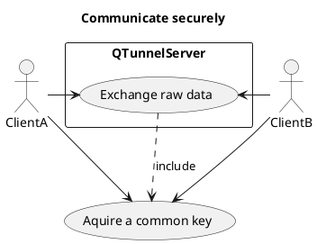

## Site Agent

The QKD devices, connections and keys are managed by a SiteAgent.

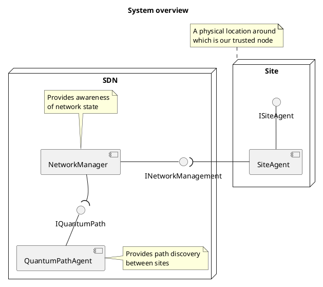

> Interfaces:
> cqp::remote::INetworkManager,
> cqp::remote::IQuantumPath,
> cqp::remote::ISiteAgent
___

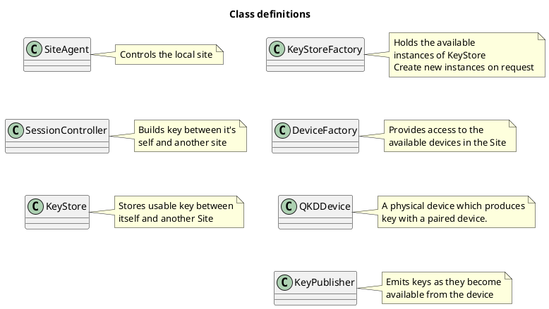

> Classes:
> cqp::DeviceFactory,
> cqp::KeyPublisher,
> cqp::keygen::KeyStore,
> cqp::keygen::KeyStoreFactory,
> cqp::SiteAgent,
> cqp::SessionController

___

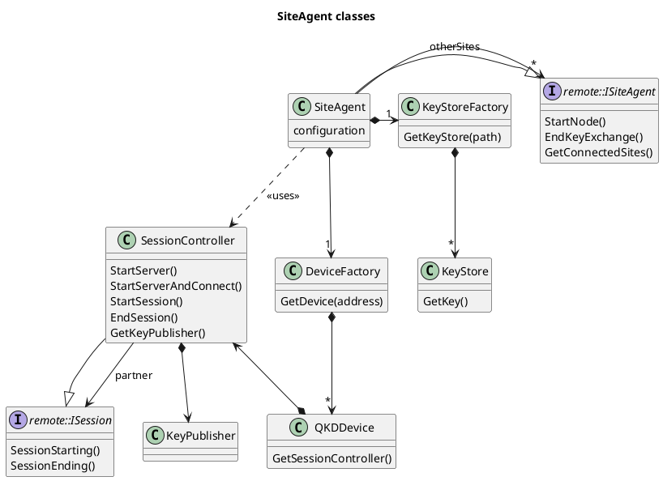

> Classes:
> cqp::DeviceFactory,
> cqp::keygen::KeyStore,
> cqp::keygen::KeyStoreFactory,
> cqp::SessionController,
> cqp::SiteAgent
>
> Interfaces:
> cqp::IQKDDevice,
> cqp::IKeyStore,
> cqp::IKeyPublisher,
> cqp::remote::IKeyFactory,
> cqp::remote::ISession,
> cqp::ISessionController

## Key Manager Algorithm

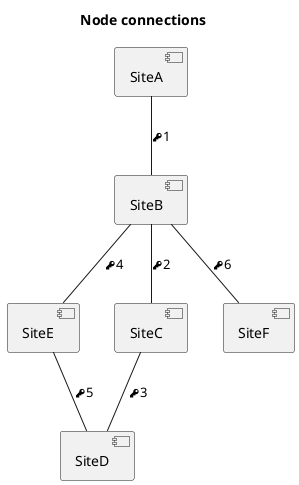

In order for the data transfer to begin, the symmetric key must first be exchanged, when more that two nodes are involved It was decided that key xor'ing would be used.  This allows multiple nodes in the chain without too much overhead.

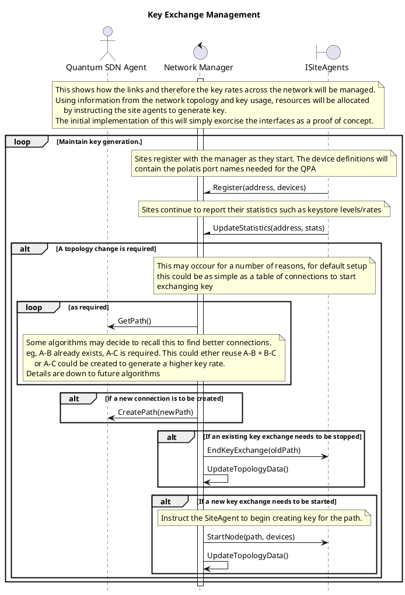

> Interfaces:
> cqp::remote::INetworkManager,
> cqp::remote::IQuantumPath,
> cqp::remote::ISiteAgent

___

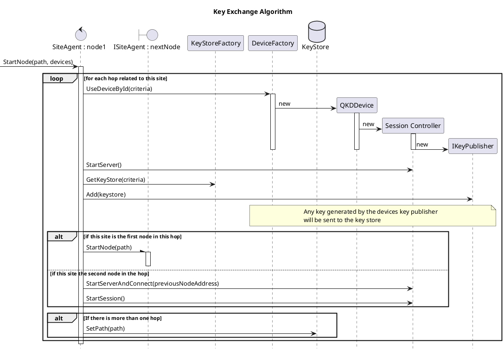

> Classes:
> cqp::DeviceFactory,
> cqp::keygen::KeyStore,
> cqp::keygen::KeyStoreFactory,
> cqp::SessionController,
> cqp::SiteAgent
>
> Interfaces:
> cqp::IQKDDevice,
> cqp::IKeyStore,
> cqp::IKeyPublisher,
> cqp::remote::IKeyFactory,
> cqp::remote::ISession,
> cqp::ISessionController

### Multi-hop

There are two possible ways of distributing the keys needed for multi hop. One is to pre-allocate a percentage of local keys to the
multi-hop key store:

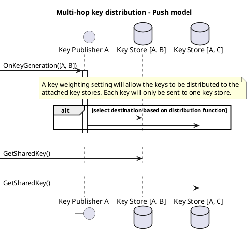
The other is to pull keys as needed from the stores:

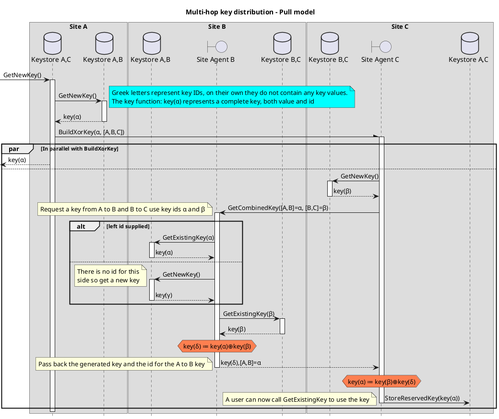

## Interfaces

Interfaces between instances, such as those between the site and the SDN will be defined with [gRPC](https://grpc.io/). The interfaces are defined using the [Protocol Buffer IDL](https://developers.google.com/protocol-buffers/) with gRPC extensions. They are built into a separate QKDInterfaces library.

## Future work

* Keys should be managed and destroyed, the requester could also specify the use of the key to allow the decision to be made.
* The QPA parameters which the QPA uses to decide on a path need to be fleshed out, data such as current load could be reported by the nodes.
* Interfacing to IDQuantique Devices - Done
* Investigate complementary technologies:
    + [MACsec](https://developers.redhat.com/blog/2016/10/14/macsec-a-different-solution-to-encrypt-network-traffic/) and [The MACsec Key Agreement - MKA](https://www.ietf.org/proceedings/76/slides/msec-5.pdf)
    + Key Management Interoperability Protocol (KMIP)
        - [Implementations](https://wiki.oasis-open.org/kmip/KnownKMIPImplementations)
        - [pyKMIP](https://pykmip.readthedocs.io/en/latest/installation.html)

## Clavis 2

There are some issues with interfacing with the USB Clavis 2 device:

- The test programs provided (QKDSequence/QKDMenu) use hardcoded port numbers and device identifiers which mean that only one instance can be run at a time
- The developmental libraries provided are not fit for purpose.
    - They are 32 bit only
    - Built for an OS which is no longer supported (Ubuntu 12.04)
    - Still have hard coded port numbers and identifiers
    - Have external dependencies to unknown versions of other libraries (boost)

### The IQSequence program

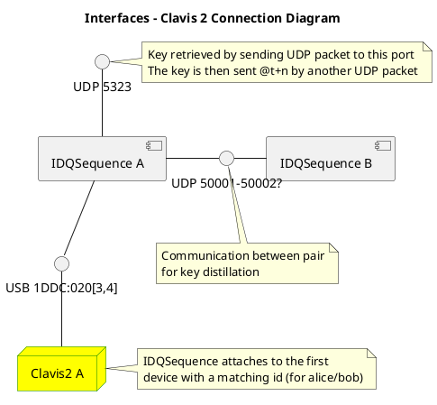
### Possible solution

By wrapping the program in a container, the network interfaces can be controlled

- Can a VLAN be used to isolate all the IDQSequence communications?

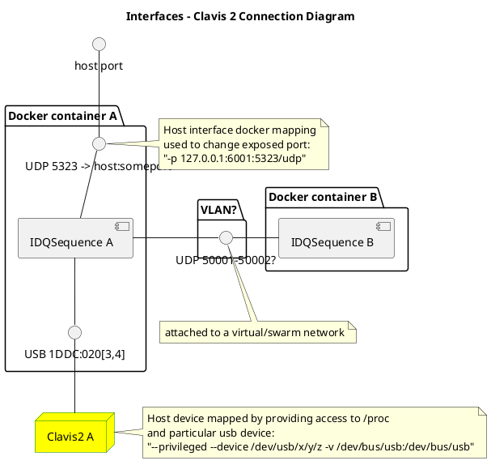

This solution has a number of issues:

- The network overlay which allows the containers to talk directly to each other requires a docker swarm with a keystore. This is faily easy to setup but is not trivial

### Docker setup

Be carful that any bridge you create doesn't interfere with existing networks/subnets
This assumes that the hosts involved have all joined the same swarm.

Create an overlay network specifically for the programs to talk to each other (ipc = inter process communication) called idq-ipc. ``attachable`` allows it to be used by normal containers - otherwise we'd need to create a service which is more complicated.

** We can ether create the network with internal - in which case port mapping with -p will be needed or without and use the bridge network with an ip address **

- internal
    * different port numbers all on localhost
    * udp difficult
- external
    * need to find the ip on the bridge interface for the container
    * udp works as is
    * same port numbers on different addresses

```bash
    sudo docker network create -d overlay --attachable idq-ipc --internal --subnet 192.168.103.0/24
```
The Docker file for configuring the system

```Dockerfile

```

Run the wrapper program which will wait for a command to start the IDQSequence program.
The name given to the contain can be used by other contains to contact it.

```bash
    sudo docker run --rm --privileged --network idq-ipc --name <somename> -p 127.0.0.1:5323:5323/udp --device /dev/usb/x/y/z -v /dev/bus/usb:/dev/bus/usb idqcontainer
```

## Current implementation

The QTunnelServer project (located under the tools folder) creates an encrypted tunnel using a settings file. It takes two instances of the QTunnelServer program, one for each end of the tunnel. The tunnel is defined by an cqp::tunnels::TunnelID for the tunnel and a cqp::tunnels::NodeIndex for either end of the tunnel.

QTunnelServer uses building blocks to implement one solution to the problem of sending encrypted data from one site to another. This solution assumes that the users do not/cannot have knowledge of QKD. This applies to most pre-existing systems which do not expose their communication mechanism.

Both the client entry/exit points and the channel for encrypted data can be any of:

* Physical ethernet port
* tcp port (as ether a server or client)
* udp port

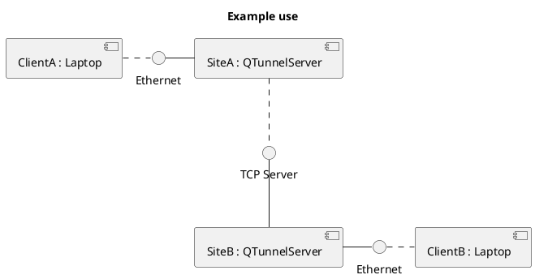

Most of these classes build the environment for cqp::tunnels::TunnelBuilder to work effectively. The interfaces isolate the two halves of the tunnel. The cqp::net::Remoting class allows the interfaces to be translated into JSON strings, currently these are used over a standard tcp connection but this could be translated to a more formal interface without affecting the worker classes.

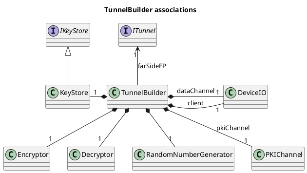

> Classes:
> cqp::tunnels::TunnelBuilder,
> cqp::keygen::KeyStore,
> cqp::DeviceIO,
> cqp::tunnels::GCM

The cqp::tunnels::TunnelBuilder generates a private and public key which allows both sides to establish an initial shared secret, this can be used for several things:

* If the key exchange mode is set to public then this key is used for all encryption/decryption
* If the key exchange mode uses the clavis 2 devices, this shared secret is used in the IDQ protocol as the initial key

cqp::ITunnel::GetPublicKey is used to get the key from the other side.

The settings can be configured by the QKDTunnel program.

### Documentation for cqp::tunnels::TunnelBuilder::ConfigureEndpoint

@copydoc cqp::tunnels::TunnelBuilder::ConfigureEndpoint

The threads then go to work processing information as it come in

### Encoding

@copydoc cqp::tunnels::TunnelBuilder::EncodingWorker

### Decoding

@copydoc cqp::tunnels::TunnelBuilder::Transfer

## QTunnelServer

The agent program loads it's settings from a json file to create tunnels. See cqp::

### cqp::IServiceCallback

Services are discovered and broadcast by cqp::net::ServiceDiscovery when the services
available changes cqp::IServiceCallback::OnServiceDetected is called.

### cqp::ITunnel

The settings for the controller can be modified with cqp::remote::tunnels::ITunnelServer::ModifyTunnel

#### cqp::ITunnel::ModifyTunnel

Passing in cqp::tunnels::Tunnel
@copydoc cqp::remote::tunnels::ITunnelServer::ModifyTunnel

#### Finally the tunnel is started with cqp::ITunnel::CreateEndpoint

Passing in cqp::tunnels::TunnelID

@copydoc cqp::remote::tunnels::ITunnelServer::StartTunnel
