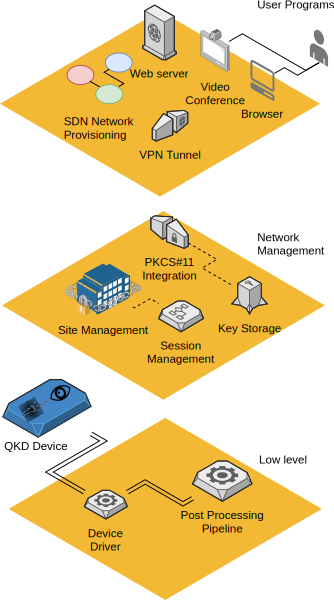

# Introduction

The purpose of this software is to provide a set of interfaces, algorithms and tools to produce a full QKD system. The aim is to reduce the barrier to entry into QKD systems by developing a strong architecture with well defined interfaces. The separation of responsibility into components will allow researchers to concentrate on a specific component, the rest of the system being provided by existing algorithms or simulators.

The system demonstrates that the symmetric keys can be used in a disposable manor rather than the current model where precious keys are derived to extend their use.
There are many utilities in place to simplify the use of the toolkit such as statistics collection for gathering data.

As well as optical device research, the system can be used to develop key management for networks.

# Access to the code
The code can be found [on GitLab](https://gitlab.com/QComms/cqptoolkit.git)

# Approach

# Components
## Statistics
The statistics component provides a means for publishing data from within an algorithm without adversely affecting the system's performance and allowing the data to be collected through a simple external interface.

## Device drivers
The system currently include drivers for the IDQuantique Clavis 2 QKD devices.
To use a device with the system, a driver needs to be written to provide data to one of the entry points of the pipeline. The driver could provide raw qubits, ready to use key or anything in between. Once a driver for specific hardware is written, the standard set of post processing tools can be used to extract usable key and provide statistics on the operation of the system as a whole.

## Post Processing
Processing of Qubits is split into 4 sections:

- Alignment of receiver with transceiver, which involve a hardware check-up loop (laser power, noise measurement...) and a line length measurement loop.
- Sifting procedure (plug & play BB84 [@QKDprotocol]) that chose the proper states after an optical setting loop of phase adjustments and visibility measurements.
- Error correction of detected bits.
- Privacy amplification to obtain the final distilled key.

Once the key is produced by the post processing it is passed to the key store.

## Key Management
There are some issues unique to shared secrets which the current public key systems do not provide for, the system tackles some of these issues by providing a standardised interface to the keys. The key store classes hold keys for specific links between two sites, while session management starts and stops the key generation.

## Site Management
Each collection of key stores constitute trusted nodes of the network, Site agents manage the connections with other sites and feature several functions [@SDNpaper] that can be integrated with software defined networks for dynamic key generation [@SDNpaper2].

# Acknowledgements
This project has been funded by [EPSRC](https://epsrc.ukri.org/) under the [Quantum communications hub](https://www.quantumcommshub.net/).
We acknowlege contributions from Dr Djeylan Aktas, Dr David Lowndes, Prof. John Rarity, Dr Chris Erven at the University of Bristol.

# References

